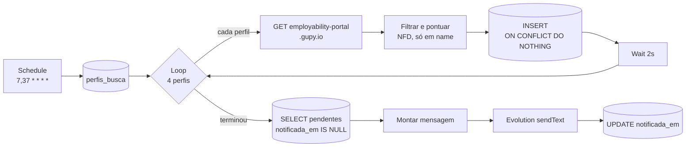

# Radar de Vagas

Monitor automatizado da API pública da Gupy que notifica no WhatsApp vagas de
estágio e júnior em TI dentro de 30 minutos da publicação.

`n8n` · `PostgreSQL` · `Evolution API` · `Python 3.12` · `Docker`

---

## O problema

Candidatura em vaga de tecnologia é um jogo de latência, não só de aderência.
Analisei meu próprio histórico de candidaturas na Gupy procurando o que separava as
que avançaram das que não. O perfil não era o gargalo. A janela era:

```
 4h após a publicação  →   7 propostas concorrentes
18h após a publicação  →  67 propostas concorrentes
```

Descobrir a vaga abrindo o site significa entrar já na faixa ruim da curva. O radar
fecha esse intervalo para 30 minutos.

## Arquitetura



O estado da notificação vive em `notificada_em IS NULL`, não no `INSERT`. Uma falha
de entrega no WhatsApp devolve a vaga ao ciclo seguinte em vez de queimá-la.

Dois workflows auxiliares cobrem o que o principal não vê: um **Error Trigger** avisa
quando o radar quebra, e um **heartbeat diário** informa quantas vagas passaram nas
últimas 24h. Sem ele, "nenhuma vaga nova hoje" e "o radar morreu na terça" produzem
exatamente o mesmo silêncio.

## O que eu medi antes de escrever código

A primeira versão do plano usava 18 termos de busca por palavra-chave. Medir contra a
API ao vivo derrubou a abordagem inteira:

| Hipótese | Medição | Consequência |
|---|---|---|
| 18 termos de keyword cobrem o mercado | 6 termos retornavam zero; `Data Engineer (Python) \| JR (Remote)` era invisível para todos eles | Trocado por 4 querystrings com filtro server-side: 117 → ~1716 vagas de cobertura |
| `pagination.total` serve para paginar | Clampa no valor de `limit` — um perfil com 1370 vagas responde `total: 100` | Paginar por `while len(data) == limit` |
| Dá para filtrar por `description` | 47% de falso positivo em "dados", 30% de falso negativo em "suporte" | Filtro aplicado só em `name` |
| `city` identifica a localidade | Vazio em 141 de 145 vagas remotas | Exibir `workplaceType`, que nunca vem vazio |
| `state=MG` funciona | Retorna 0. A API quer `state=Minas Gerais` | — |
| Acento é opcional | `Uberlandia` → 0 resultados. `Uberlândia` → 392 | — |
| `publishedDate` tem um formato | Dois: ISO-8601 com `Z` e data pura sem timezone | Parser força UTC quando falta timezone |

Dois bugs saíram de rodar de verdade, não de ler o código:

**Encoding.** O stdout do Windows é cp1252 e estoura `UnicodeEncodeError` em título
com emoji — 7 em cada 253 vagas. O coletor força UTF-8 no stdout.

**Negrito vazando.** Título da Gupy às vezes termina com espaço. O WhatsApp só fecha
o `*` quando ele está colado a um caractere não-branco, então `*título *` era exibido
com os asteriscos crus. Apareceu no print da primeira notificação real.

## Decisões de engenharia

**Filtro no servidor, não no cliente.** A API da Gupy aceita `type`, `isRemoteWork` e
`city`. Quatro querystrings cobrem o que 18 buscas por palavra-chave cobriam pior.

**Chave primária composta `(fonte, id_externo)`.** O id da Gupy só é único dentro da
Gupy. A composta evita colisão quando entrar uma segunda fonte.

**`COPY` em vez de `INSERT` montado por string.** Títulos vêm com aspas, vírgulas e
emoji direto de uma API pública. A carga vai para uma tabela temporária via CSV e daí
para `vagas` — concatenar isso em SQL seria injeção esperando acontecer.

**A notificação devolve *quais* vagas saíram, não quantas.** Se a terceira mensagem
falha, as duas primeiras seguem carimbadas e não são reenviadas no ciclo seguinte.

**Paridade entre os dois caminhos.** O filtro existe em Python (`scripts/coletar.py`)
e em JavaScript (nó Code do n8n). Sobre as mesmas 253 vagas reais, os dois aprovam as
mesmas vagas com os mesmos scores — testado, não presumido.

**Cron com jitter (`7,37`).** 192 requests/dia é volume irrelevante para um endpoint
que o portal público chama de qualquer browser. O que chama atenção é regularidade de
relógio, não volume.

**Segredo fora do git desde o commit inicial.** O `.gitignore` foi o primeiro arquivo
versionado, antes de qualquer credencial existir. A chave da Evolution entra no n8n
como credencial Header Auth, nunca como header literal — o export do workflow grava
header literal em texto puro. E o número de telefone mora numa tabela de configuração,
não no JSON: chave se rotaciona, telefone não.

## Como rodar

O repositório é autocontido. O `docker-compose.yml` sobe Postgres, Redis, Evolution e
n8n com nomes e portas próprios, escolhidos para não colidir com outros stacks na
mesma máquina.

```bash
cp .env.example .env      # preencher RADAR_PGPASSWORD e EVOLUTION_APIKEY
docker compose up -d
py -3.12 scripts/coletar.py --dry-run
```

O schema é criado sozinho na primeira subida. O passo a passo completo — incluindo o
pareamento do WhatsApp e a importação dos workflows — está em **[SETUP.md](SETUP.md)**.

| Modo do coletor | Efeito |
|---|---|
| `--dry-run` | Coleta e imprime no terminal. Não grava, não envia |
| `--backfill` | Grava o estoque atual já marcado como notificado, para o primeiro ciclo não disparar tudo de uma vez |
| `--notify` | Coleta, grava, e envia no WhatsApp o que ainda não foi entregue |
| `--test-notify` | Manda uma mensagem sintética: testa só a entrega |
| `--test-pipeline` | Insere vaga sintética, notifica e limpa: prova o caminho banco → WhatsApp inteiro |

## Estrutura

```
├── docker-compose.yml     stack autocontido (radar-*, portas 5434/8081/5679)
├── SETUP.md               instalação numa máquina nova, do zero
├── db/00-create-db.sql    CREATE DATABASE, idempotente via \gexec
├── db/01-schema.sql       tabelas, índices e perfis de busca
├── scripts/coletar.py     coletor: 5 modos, só stdlib, sem pip install
├── n8n/radar-vagas.json            workflow principal, 11 nós
├── n8n/radar-vagas-erro.json       Error Trigger
├── n8n/radar-vagas-heartbeat.json  heartbeat diário
└── docs/                  observações de filtro e evidências
```

## Fora de escopo, e por quê

| Não fiz | Motivo |
|---|---|
| Envio automático de mensagem no LinkedIn | Viola o Contrato do Usuário da plataforma. A conta é meu principal ativo profissional |
| Candidatura automática | A Gupy pontua aderência. Volume genérico piora o resultado, não melhora |
| LinkedIn como segunda fonte | Fase posterior. Abrir agora dobra a superfície de falha antes da primeira estar estável |
| Painel web | O WhatsApp é a interface. Este sistema não tem tela |
| CRM de networking, gerador de mensagem | Fases posteriores, deliberadamente fora deste escopo |

A coluna `status` existe no schema e não é usada. Ela é o gancho da fase de CRM, e
está documentada como tal em vez de removida.

## Limites conhecidos

O filtro depende de o nível aparecer no **título**. Vaga júnior anunciada como
"Analista de Sistemas" sem qualificador é invisível para o radar — e 174 de 253 vagas
coletadas caem fora justamente por isso, que é o comportamento desejado mas também o
teto do método.

Falsos negativos observados na primeira execução estão registrados em
[docs/observacoes-filtro.md](docs/observacoes-filtro.md) em vez de corrigidos na hora:
ajustar o filtro no meio da construção impede saber se uma mudança de volume veio do
filtro ou da orquestração.

## Estado

```
[x] Etapa 0 — coleta e exibição no terminal
[x] Etapa 1 — entrega no WhatsApp
[x] Etapa 2 — persistência e deduplicação
[x] Etapa 3 — orquestração autônoma no n8n
```

---

Alonso Moura Germano · Ciência da Computação, UFU · Uberlândia/MG
[alonsogermano.com](https://alonsogermano.com)
